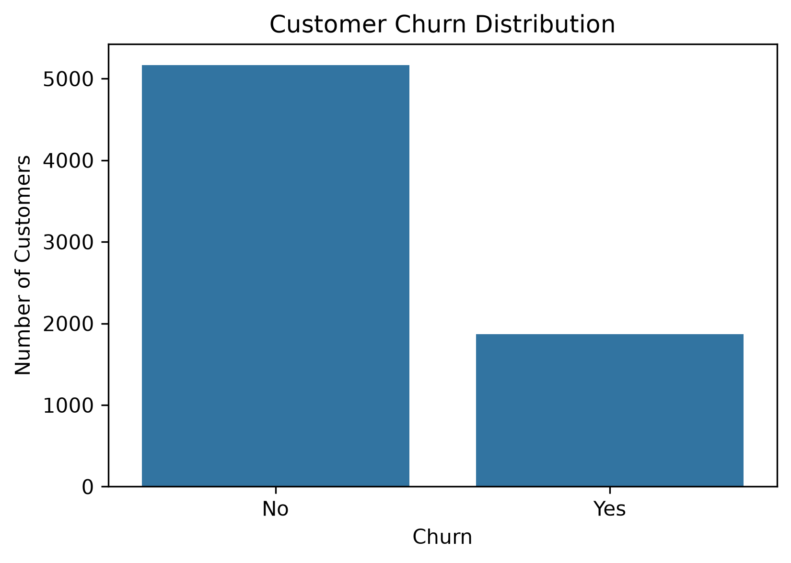
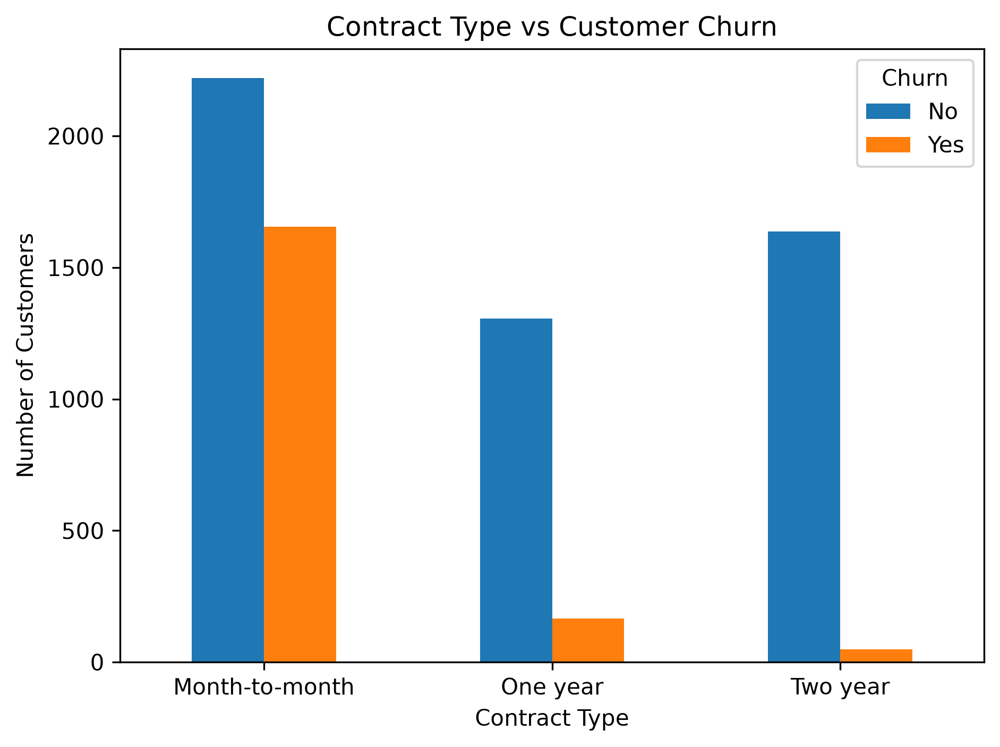
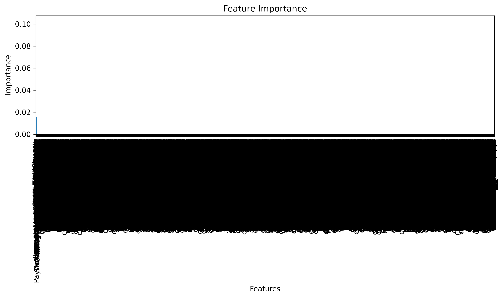
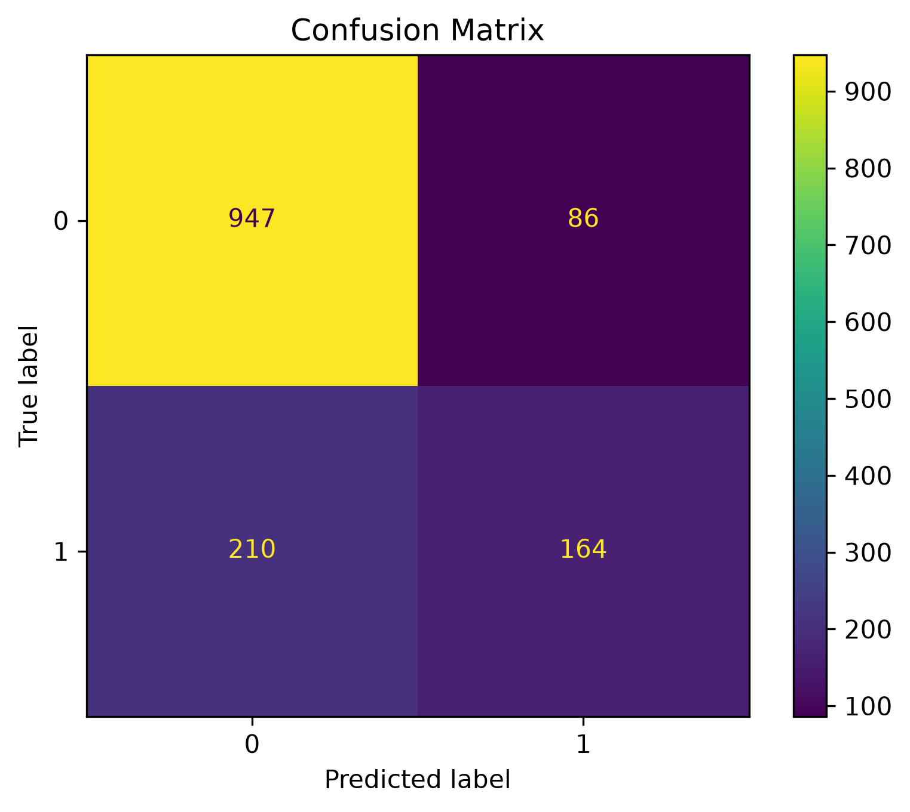

# 📊 Customer Churn Prediction

## 📌 Project Overview

This project predicts whether a telecom customer is likely to churn using Machine Learning. The objective is to help telecom companies identify customers who are at risk of leaving and improve customer retention strategies.

---

## 🎯 Business Problem

Customer churn is one of the biggest challenges faced by telecom companies. By predicting which customers are likely to leave, businesses can take proactive actions such as offering personalized plans, discounts, or better customer support to retain valuable customers.

---

## 📂 Dataset

**Dataset:** Telco Customer Churn Dataset

- Total Records: **7,043**
- Features: **21**
- Target Variable: **Churn (Yes/No)**

The dataset contains:

- Customer demographics
- Account information
- Services subscribed
- Contract details
- Billing information
- Churn status

---

## 🛠 Technologies Used

- Python
- Pandas
- NumPy
- Matplotlib
- Seaborn
- Scikit-learn
- Jupyter Notebook
- Git
- GitHub

---

## 🔄 Project Workflow

1. Data Collection
2. Data Cleaning
3. Exploratory Data Analysis (EDA)
4. Feature Engineering
5. Data Preprocessing
6. Model Building
7. Model Evaluation
8. Model Saving
9. Customer Churn Prediction

---

## 🤖 Machine Learning Models

- Logistic Regression
- Random Forest Classifier

---

## 📈 Results

- Cleaned and preprocessed telecom customer data.
- Performed Exploratory Data Analysis (EDA) to understand customer behavior.
- Trained and evaluated multiple machine learning models.
- Identified important features influencing customer churn.
- Saved the trained model for future predictions.

---

## 📊 Project Visualizations

### Customer Churn Distribution



---

### Contract Type vs Customer Churn



---

### Feature Importance



---

### Confusion Matrix



---

## 📁 Folder Structure

```text
Customer-Churn-Prediction/
│
├── Data/
├── images/
├── models/
├── notebooks/
├── reports/
├── sql/
├── LICENSE
├── README.md
└── requirements.txt
```

---

## 🚀 How to Run

### Clone the repository

```bash
git clone https://github.com/ashwithagollapelly/Customer-Churn-Prediction.git
```

### Navigate to the project

```bash
cd Customer-Churn-Prediction
```

### Install dependencies

```bash
pip install -r requirements.txt
```

### Launch Jupyter Notebook

```bash
jupyter notebook
```

Open the notebook and run all cells.

---

## 💡 Future Improvements

- Deploy the model using Streamlit.
- Improve model performance with XGBoost.
- Build an interactive Power BI dashboard.
- Perform hyperparameter tuning.
- Add cross-validation for better model evaluation.

---

## 👩‍💻 Author

**Ashwitha Gollapelly**

GitHub: https://github.com/ashwithagollapelly

---

## 📜 License

This project is licensed under the **MIT License**.
